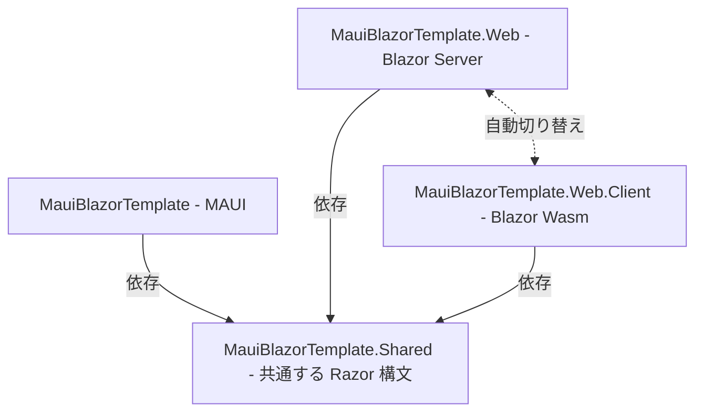

[.NET MAUI Advent Calendar 2024](https://qiita.com/advent-calendar/2024/dotnetmaui) 2日目の記事です。

## TL;DR;

.NET MAUI と Blazor (Razor 構文) の技術を利用し、同一のコードから Windows, macOS, Android, iOS, **Web** (新規) 向けに出力できるものです。.NET 8 時代に実装され、.NET 9 以降のテンプレートで利用可能となっています。

## MAUI Blazor Web App とは何?

MAUI Blazor Web App[^true-name] は .NET 9 で追加されたテンプレートです。テンプレートには入っていませんが、一応 [.NET 8 版](https://github.com/dotnet/blazor-samples/tree/main/8.0/MauiBlazorWeb)も存在します。[^net8-maui-blazor-web]

MAUI Blazor Web App は Razor 構文を .NET MAUI と Blazor で共通利用することで、.NET MAUI のターゲットプラットフォームの Windows, macOS, Android, iOS に加え、Blazor のターゲットである Web 向けの出力が可能になっています。

詳しく知るには、.NET 7 で導入された MAUI Blazor Hybrid[^true-name] について知る必要があります。

[^true-name]: ちなみに、それぞれの正式名称は .NET MAUI Blazor Hybrid App と .NET MAUI Blazor Hybrid and Web App です。名前が長いですね。(参考元: https://visualstudiomagazine.com/Articles/2024/06/20/net-9-preview-5.aspx)
[^net8-maui-blazor-web]: .NET 8 の前期は、このリポジトリがなかったので頑張って対応していたらしいです。(参考元: https://blazor-master.com/blazor-hybrid-maui-rcl/)

<!-- https://zenn.dev/microsoft/articles/blazor-dotnet8-all -->

### MAUI Blazor Hybrid

(現在もこのテンプレートは残っており、引き続き利用可能です)

MAUI Blazor Hybrid は MAUI 内でウェブサイトを閲覧するように、Blazor を利用するというものです。

これによるメリットを紹介します:
1. Blazor コードの速度上昇  
Blazor Wasm は WebAssembly であるがゆえにスペック的な制約が課されるため、やや低速になりがちです。しかし、MAUI Blazor Hybrid は、Blazor のコードが WebAssembly に変換されないため、ネイティブアプリケーションとして高速な動作が可能です。
1. MAUI を HTML で書ける  
MAUI は規定では XAML でデザインを決めますが、Blazor を利用することで、代わりに HTML を使うことが可能です。
1. 多彩なコントロールが利用可能  
現時点の MAUI では公式ライブラリでファイルの読み込みなどは対応していません (CommunityToolkit が半公式としてよく利用されている) が、Blazor は対応しているので、Blazor 側の機能として利用できます。
1. ネイティブ機能が利用可能  
Blazor は Web 向けのプラットフォームなので、単独でネイティブ機能を使うことは不可能です。しかし、これは MAUI と組み合わさっているため、もちろんネイティブ機能が利用できます。

などです。

<!-- https://learn.microsoft.com/ja-jp/aspnet/core/blazor/hybrid/tutorials/maui -->

### MAUI Blazor Web App

以上のように、MAUI Blazor Hybrid は多彩なメリットにより、非常に便利なテンプレートです。が、これを更に拡張したのが MAUI Blazor Web App です。

MAUI Blazor Hybrid は、当然 MAUI と Blazor の両方のコードが存在しています。ここで、Blazor のコードから Web 向けの出力にも対応しよう、ということで作成されたのがこのテンプレートになっています。(先述の通り、この構想には MAUI の大規模な変更が不要だったため、.NET 9 のリリースより前の、.NET 8 のマイナーアップデート (SR) 中にテンプレートが公開されていました)

Web 向けの出力が対応したことにより、

- お試し版として Web で利用してもらい、気に入ってもらったらネイティブ版をインストールしてもらう
- Web 向けでは軽量の機能のみを提供、ネイティブアプリケーションで高度な機能を提供  
(ネイティブのほうが C# の動作が高速で、ネイティブ機能が使えるため)

などの使い方が想定できそうですね。デバッグに関しても Web 版を利用できるので楽そうです。

<!-- 
https://learn.microsoft.com/ja-jp/aspnet/core/blazor/hybrid/tutorials/maui-blazor-web-app
https://learn.microsoft.com/ja-jp/aspnet/core/blazor/hybrid/reuse-razor-components
-->

## 実際に使ってみる

さてさて、長々と説明をしていましたが、せっかくなので使ってみましょうか。

### 環境

今回は Windows を利用します。

```env
OS: Windows 11
IDE: Visual Studio 2022
```

(MAUI のワークロードのインストールはしている前提とします)

### テンプレートを作成

Visual Studio を起動し、"新しいプロジェクトの作成"を選択します。


".NET MAUI Blazor Hybrid and Web App" を選択します。


今回の名前は "MauiBlazorTemplate" とします。


フレームワークは .NET 9.0 のみ選択可能でした。Render mode に関しては、"None", "Server", "WebAssembly", "Auto" から選択できました。今回は "Auto" としています。


これだけで作成できます。

### Web 向けとネイティブ向けの出力

作成されたプロジェクトの構成は以下となります。



`MauiBlazorTemplate.csproj` をビルドすることで、ネイティブ向けが、`MauiBlazorTemplate.Web.csproj` をビルドすることで、Web 向けが出力できます。共通する Razor 構文 (HTML と C# のコード) は `MauiBlazorTemplate.Shared` で書きます。

(おそらく `MauiBlazorTemplate.Web` と `MauiBlazorTemplate.Web.Client` はほぼいじらなくて大丈夫です。基本 `MauiBlazorTemplate.Shared` を編集し、ネイティブ機能を使うときのみ `MauiBlazorTemplate` を編集する、というのが運用法として良さそうです)


それぞれビルドしてみると、以下のようになります。

素晴らしいですね!


## おわり

すごい!!

便利…かも?

## おまけ

dotnet cli でテンプレート見てたら、面白そうなのが増えてました。(昔からあったかも?)

```shell
dotnet new list
```
```
# (興味のあるやつだけ抜粋。ほとんどは省略)

テンプレート名                                   短い名前                    言語        タグ                                                                         
-----------------------------------------------  --------------------------  ----------  -----------------------------------------------------------------------------
.NET MAUI Blazor Hybrid and Web App              maui-blazor-web             [C#]        MAUI/Android/iOS/macOS/Mac Catalyst/Windows/Tizen/Blazor/Blazor Hybrid/Mobile
.NET MAUI Blazor アプリ                          maui-blazor                 [C#]        MAUI/Android/iOS/macOS/Mac Catalyst/Windows/Tizen/Blazor/Blazor Hybrid/Mobile
Android Java ライブラリ バインド                 android-bindinglib          [C#]        Android/Mobile
Android アプリケーション                         android                     [C#]        Android/Mobile
ASP.NET Core Web アプリ                          webapp,razor                [C#]        Web/MVC/Razor Pages
dotnet gitignore ファイル                        gitignore,.gitignore                    Config
dotnet ローカル ツール マニフェスト ファイル     tool-manifest                           Config
EditorConfig ファイル                            editorconfig,.editorconfig              Config
global.json ファイル                             globaljson,global.json                  Config
MSBuild Directory.Build.props ファイル           buildprops                              MSBuild/props
MSBuild Directory.Build.targets ファイル         buildtargets                            MSBuild/props
MSBuild Directory.Packages.props ファイル        packagesprops                           MSBuild/packages/props/CPM
NuGet Config                                     nugetconfig,nuget.config                Config
Wasi Console App                                 wasiconsole                 [C#]        Wasi/WasiConsole
WebAssembly Browser App                          wasmbrowser                 [C#]        Web/WebAssembly/Browser
WebAssembly Console App                          wasmconsole                 [C#]        Web/WebAssembly/Console
プロトコル バッファー ファイル                   proto                                   Web/gRPC
```

Wasm とかもっと使ってみたいですね。
