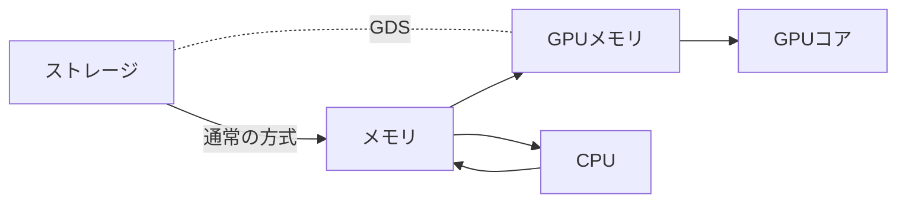

## はじめに

本日 (2025/10/4)、新潟県新潟市の新潟国際情報大学にて開催された、Open Source Conference 2025 Niigata (以下、OSC 2025 Niigata と表記) に単独参加して参りました。(OSC は初めてです)

その際のレポートを記載していきます。

([YouTube アーカイブ](https://www.youtube.com/live/3knDeyjQgA8?si=WeY7LtwvpVFgE_0T)見れます!)

<!-- (組織名は敬称略) -->

## OSC とは?

> オープンソースカンファレンスは全国各地で開催されている、オープンソースおよび地域コミュニティの文化祭です。セミナーおよびブース展示で日頃の活動について発表、情報交換を行う集まりです。
> 
> *([OSC 2025 Niigata](https://ospn.connpass.com/event/364901) より引用)*

つまり、OSS 関連、「ブース+発表」形式の楽しいイベントです!

## OSC 2025 Niigata

### 開催情報

| 情報 | 内容 |
| -- | -- |
| 日程 | 2025/10/04 (土) 10:30-16:30 |
| 会場 | 新潟国際情報大学 新潟中央キャンパス 9F (新潟県新潟市中央区 上大川前通7番町1169番地) |
| 内容 | オープンソースに関する最新情報の提供 (展示 / セミナー) |
| 形式 | 対面/オンライン (Zoom? と [YouTube Live](https://www.youtube.com/live/3knDeyjQgA8?si=WeY7LtwvpVFgE_0T)) |
| 参加人数 | 30人程度 |
| イベントページ | <https://ospn.connpass.com/event/364901> |
| 費用 | 無料 |

(おそらく) 大半の人は OSC ガチ勢で、学生は2-3人程度、私のような初参加の人は少なそうな印象でした。

### タイムテーブル

| 時間 | 内容 | コミュニティー / 発表者 |
| -- | -- | -- |
| 10:30-11:00 | MyDNS.JPで自分のドメインを使ってみよう! 2025年版 | Future Versatile Group - MyDNS.JP / T.Kabu 様 |
| 11:10-11:40 | NetBSDのご紹介 | 日本NetBSDユーザーグループ / 蛯原 純 様 |
| 11:40-13:00 | (お昼休み) | - |
| 13:00-13:30 | GPUを活用した爆速DBによるビッグデータ分析について | 日本仮想化技術株式会社 / 宮原 徹 様 |
| 13:40-14:10 | ブロックチェーンの概要説明および技術普及推進に向けたNEM Symbolコミュニティの取組の紹介 | NPO法人NEMTUS / mikun 様 |
| 14:20-14:50 | PostgreSQLで知識検索をスケーラブルに！RAGと分散DBの融合 | 日本PostgreSQLユーザ会 / 三谷 篤 様 |
| 14:50-15:10 | (展示タイム) | - |
| 15:10-15:40 | MySQLのお話し (仮) | 日本MySQLユーザ会 (MyNA) / 坂井 恵 様 |
| 15:50-16:10 | ライトニングトーク | 複数人 |

後半でより詳しく書きます。

私は、11:20頃から最後までいたので、MyDNS の話以外は全部聞けました。(本当は最初から見たかったのですが、思ったよりも長く寝てしまった (笑))

午後はほとんど SQL の話です。SQL 関連はあまり知らなかったので、いい情報を仕入れることができました!

### 外観

<!--  -->

<!--  -->

入ると、すぐのところに OSC の旗がありました。

<!--  -->

おしゃれなオブジェ。今気づいたのですが、イルカのオブジェなのは、近くにマリンピア日本海 (イルカショーをしてる水族館) があるからかもしれないです。

<!--  -->

エレベーターのところにも表示があり、わかりやすかったです。近くに案内してくれる人もいました。(おそらく大学の管理人みたいな人)

<!--  -->

### 会場

講義場の前方 (写真で写っている部分) で発表が行われ、後方でブースが設置されていました。

### 発表

簡単な感想を書いていきます。

#### MyDNS.JPで自分のドメインを使ってみよう! 2025年版

(Future Versatile Group - MyDNS.JP / T.Kabu 様)

~~遅刻で見れなかった…~~

#### NetBSDのご紹介

(日本NetBSDユーザーグループ / 蛯原 純 様)

OpenBSD 上で PC-6001 のエミュレーターを動かし、2コマアニメーション (初音ミク?) を動かしていました。

すごい…。けど、技術レベルが高すぎて、自分の知識ではわからない部分が多かったです。あと、Raspberry Pi 上で BSD を動かしていました。

#### GPUを活用した爆速DBによるビッグデータ分析について

(日本仮想化技術株式会社 / 宮原 徹 様)

GPU を用いて、DB (PostgreSQL) の高速計算・検索を行う方法についてです。

CPU を使う通常の方式ではなく、GPU / GDS を用いる特殊方式を利用することで、GPU の多コアによって高速処理ができるとのことでした。

(GDS は、データを GPU メモリに直接コピーできる特殊仕様。Geforce には搭載されていないが、A\*000 (旧 Quadro) シリーズや、Ada などのサーバー向け GPU には搭載されている)

<!-- SQL の処理は正確性が求められるため、殆どが CPU での処理だと考えていました。しかし、検索や AI などの並列処理、処理速度を重視した分野では GPU が活用できると知り、意外に感じました。(私は SQL とは離れた界隈なので、業界では普通なのかもしれませんが、そのような処理方法があるのかと、衝撃でした) -->

#### ブロックチェーンの概要説明および技術普及推進に向けたNEM / Symbolコミュニティの取組の紹介

(NPO法人NEMTUS / mikun 様)

食の情報をブロックチェーンで記録する、というのは面白いですね。(というか、技術的にできるんですね)

スライドで出てきた「だいたいウニ」は、「大体」(おおまかに) と「代替」(代わりの) をかけたダジャレじゃないか…?と思ったのですが、残念ながら発表では触れられていませんでした。(深読みしすぎ?)

<!-- ブロックチェーンについては、あまり知らないので、知識をつけておかないとですね。 -->

#### PostgreSQLで知識検索をスケーラブルに！RAGと分散DBの融合

(日本PostgreSQLユーザ会 / 三谷 篤 様)

AI サーバーと、それに利用する DB (SQL) の分散についてお話されていました。

「Oracle からの置換」で検索に成功しており、かなり AI の精度が高そうでした。

詳しくないですが、実用的に使えるアイデアっぽそうでした。興味深い。

#### MySQLのお話し (仮)

(日本MySQLユーザ会 (MyNA) / 坂井 恵 様)

**本番環境では MySQL 8.4.x を使おう**

MySQL はバージョン関係が複雑になっており、それに関してお話されていました。8.4.x 系は LTS (ロングサポート) であり、本番環境では強く推奨されているようです。

後半は、地理情報系についてお話されていました。

<!-- あと、マリンピア日本海 (水族館) でのイルカショーから、イルカ = MySQL のイメージを持って欲しい、という話も。 -->

#### ライトニングトーク

(複数人)

[PyCon JP 2026](https://2026.pycon.jp) 開催します。[座長 (リーダー) 募集中](https://pyconjp.blogspot.com/2025/08/call-for-pyconjp2026-chair.html)!
あと、「[Alma Linux で NVIDIA の GPU を使ってローカル LLM を動かそう](https://almalinux.connpass.com/event/371263)」をやります! (日本仮想化技術株式会社 / 宮原 徹 様)

OSC 東北@仙台を検討しています。(Future Versatile Group - MyDNS.JP / T.Kabu 様)

Ruby on Rails の Gems 騒動について (板垣 正敏 様) → 興味あったものの、調べられていなかった内容なので、今回詳しく知ることができて良かったです。

「[オープンソースのくだらないプログラム](https://www.ossaj.org/oss-stupid-program-2025)」コンテスト開催しています。 (オープンソースソフトウェア協会[^ossaj] / おおがま しゅうさく 様)

[^ossaj]: https://www.ossaj.org/archives/2691

「OSC サミット 2025 沖縄」開催、OSC Niigata は来年で20周年です!慣例では長岡になりますが、どうしましょうか…! (OSPN / みやはら とおる 様)

### ブース

いろいろもらえました!

主には PostgreSQL、MyDNS、Alma Linux (日本仮想化技術株式会社) の方と交流できました。

PostgreSQL の冊子は有料イベントで配布されていたもの?らしいのですが、無償でくれました!ありがとうございます。中は、PostgreSQL 単独イベントでの発表で利用されたスライド一覧になっています。

MyDNS の紙の裏面にはサーバーガイドが載っているのですが、相当根気がないとクラウドサーバー系になるという悲しみが… (でも実際そう)

参加している人たちは固定化しているのか、ほとんどが知り合いみたいな雰囲気が出ていたので、はじめは若干話しかけづらいかもしれません。こんな時は、昼休憩などの人数が少ない時間にブースの人たちに話しかけるのがコツです! (コミュ症ですが、なんとかなりました)

## 最後に

PostgreSQL を中心として、DB/SQL 関連の話題が多く、とても学びになりました。今まで、データ処理をする機会がすくなく、SQL を触ったことがなかったのですが、今後ぜひ試してみたいと考えています。(DB 高速化、並列化の話は特に面白かったです)

私は普段、C# アプリケーション系やウェブ系、KDE などのデスクトップ環境系をメインとしている人間なので、普段知ることのできない情報に多く触れられて良かったです。興味の幅や知識、外部への認知を深められたと感じています。

<!-- OSS 関連知識はあまりない方だと思いますが、それでもかなり楽しめたと感じています。 -->

OSC 2025 Niigata 運営、ブース展示や発表を行ってくれた方々、その他関係者皆様に大きな感謝を!!

また機会があれば OSC 参加したいです!
